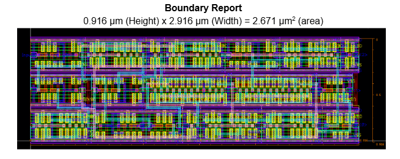

# Multi-Layer Perceptron - Gate-Level & Layout Design  

This repository contains the design and optimization of a **Multi-Layer Perceptron (MLP)** implemented in **Cadence Virtuoso**. The project includes:  

1. **Schematic Design** – Gate-level implementation of the MLP.  
2. **Layout Design** – Physical layout of the MLP in **Cadence Virtuoso**.  
3. **Layout Optimization** – Area optimization to reduce the overall footprint.
4. **Project report** - [project_stage_4.pdf](project_stage_4.pdf)

## Tools Used  
- **Cadence Virtuoso** – Schematic & Layout design  
- **Standard Cell Libraries** – For gate-level design  
- **DRC & LVS** – Design rule and layout verification  

### Optimized Neuron Layout 

### Block Diagram Schematic

