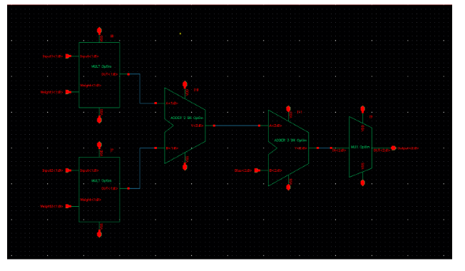

# Multi-Layer Perceptron - Gate-Level & Layout Design  

This repository contains the design and optimization of a **Multi-Layer Perceptron (MLP)** implemented in **Cadence Virtuoso**. The project includes:  

1. **Schematic Design** – Gate-level implementation of the MLP.  
2. **Layout Design** – Physical layout of the MLP in **Cadence Virtuoso**.  
3. **Layout Optimization** – Area optimization to reduce the overall footprint.  
4. **Verification** – Simulated and verified using **HSPICE**.  
5. **Project Report** – [project_stage_4.pdf](project_stage_4.pdf)  

## Project Overview  
This project is a simple implementation of a **neuron** that can be used in a neural network. It takes in a series of weights and biases and returns an output value based on an activation function.  

Our design consists of:  
- **Multipliers** – Multiply inputs by trained weights to tune the neuron.  
- **Adders** – Sum all multiplied values into a single output.  
- **Multiplexer (MUX)** – Implements the **ReLU activation function**.  

Most transistors are sized with a **beta ratio of 1.5** to ensure **balanced rise and fall times**. The exception is our **mirror adder cells**, which use a **beta ratio of 1** to maintain a more compact layout.  

## Tools Used  
- **Cadence Virtuoso** – Schematic & Layout design  
- **HSPICE** – Circuit simulation & verification  
- **[ASAP7 PDK Library](https://asap.asu.edu/)** – For gate-level design  
- **DRC & LVS** – Design rule and layout verification  

## Optimized Neuron Layout  

  

## Block Diagram Schematic  

  
